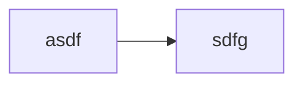

# Install ollama and open-WebUI

## docker
sudo apt install docker.io
sudo docker ps                 # Shows what is running
sudo docker stop open-webui
sudo docker rm open-webui
systemctl is-enabled docker    # Check if docker will autostart
sudo docker ps -a --format '{{.Names}}' | xargs -r -n1 sudo docker inspect -f '{{.Name}}: {{.HostConfig.RestartPolicy.Name}}'

## open ollama config
sudo systemctl stop ollama
sudo systemctl edit ollama.service
  add service
  Environment="OLLAMA_HOST=0.0.0.0:11434"
sudo systemctl start ollama
sudo ss -ltnp | grep 11434      # Verify *:11434 listed

## install Open-WebUI
docker run -d \
  -p 3000:8080 \
  --add-host=host.docker.internal:host-gateway \
  -v open-webui:/app/backend/data \
  --name open-webui \
  --restart always \
  ghcr.io/open-webui/open-webui:main
sudo docker exec -it open-webui sh
(in prompt) curl http://host.docker.internal:11434/api/tags
(in prompt) exit
sudo docker restart open-webui

## Ollama connection
OLLAMA_HOST=0.0.0.0 ollama serve
curl http://localhost:11434/api/tags   # returns json tags
docker run -d --network=host -v open-webui:/app/backend/data -e OLLAMA_BASE_URL=http://127.0.0.1:11434 --name open-webui --restart always ghcr.io/open-webui/open-webui:main

