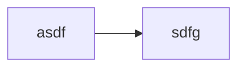

# Markdown

## Desktop
create file.desktop
```file
[Desktop Entry]
Name=Google
Comment=Shortcut to Google
Icon=/usr/share/icons/google-icon.png
Type=Application
Exec=xdg-open https://www.google.com
Terminal=false
```

## Install stuff

### docker
sudo apt install docker.io
sudo docker ps                 # Shows what is running
sudo docker stop open-webui
sudo docker rm open-webui
systemctl is-enabled docker    # Check if docker will autostart
sudo docker ps -a --format '{{.Names}}' | xargs -r -n1 sudo docker inspect -f '{{.Name}}: {{.HostConfig.RestartPolicy.Name}}'

### start stop service
sudo systemctl stop ollama
sudo systemctl edit ollama.service
sudo systemctl start ollama



